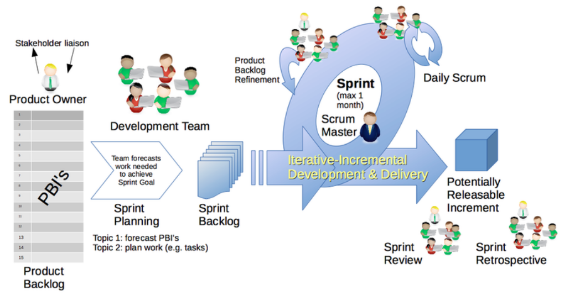
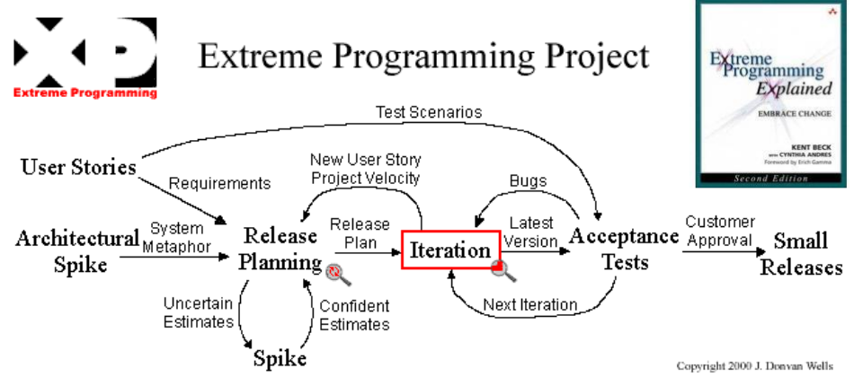
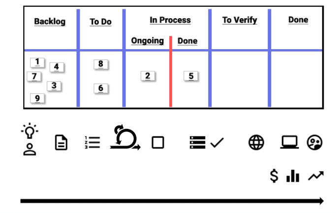

# Introducción

 ## ¿Que hace la gestión de desarrollo?

La gestión de desarrollo es el proceso de planificar, coordinar y controlar el desarrollo de un sistema de información.

Una vez que se planifica el desarrollo de un sistema se debe estimar el tiempo y los recursos necesarios para llevar a cabo el proyecto. La idea de la materia es medir efectivamente el tiempo y recursos que llevo hacer el sistema y compararlo con lo estimado. Para despues poder mejorar el proceso de desarrollo.

## Ingeniería de Software

Evidencia se crea junto con el producto.

# Metodologías: la mirada agil

## Scrum

* Como que tienen que estar organizados los equipos 
* Como se organiza el proyecto en el tiempo
* Artefactos de entrada y salida del proyecto
    
    * **Product backlog**: Caracteristicas que el producto debe tener(puede llegar a tener). Esto va a mapear con un conjunt de tareas para poder llevar a cabo esas caracteristicas. Cada uno de los elementos se llaman product backlog items, estas estan ordenadas por prioridades.

    *   **Potentialliy Releseable Increment**: Tiene que ser un producto potencialmente entregable.

* **Sprint backlog**: Es un conjunto de tareas que se van a realizar en un sprint. Se toman tareas del product backlog y se las asigna a un sprint backlog. Se hace una reunion de planificacion de sprint para asignar las tareas.

* **Development Team**: Es el equipo de desarrollo, es el que va a llevar a cabo las tareas del sprint backlog.

* **Sprint**: Es un periodo de tiempo en el que se va a llevar a cabo el desarrollo de las tareas del sprint backlog. Puede durar de 1 a 4 semanas.

* **Product Owner**: Es el representante del cliente, es el que va a definir las caracteristicas del producto. Es el que sabe lo que el cliente quiere y lo que necesita. Es el dueño del product backlog.

* **Scrum Master**: Es el encargado de que se cumplan las reglas de scrum. Que este la estrucutura buscada y que se cumpla el proyecto.

* **Reuniones**: 
    * *Sprint Planning*: Se define que se va a hacer en el sprint. Como se va a llevar a cabo y quien va a participar.
    * *Daily Scrum*: Reunion diaria para ver que se hizo ayer, que se va a hacer hoy y si hay algun impedimento.
    * *Sprint Review*: Se muestra lo que se hizo en el sprint y hay una retroalimentción desde el cliente para posible mejoras en caso de ser necesario. Lo hace el equipo de desarrollo hacia el cliente.
    * *Sprint restrospective*: Se hace una revision de lo que se hizo en el sprint y se ve que se puede mejorar. Lo hace el equipo de desarrollo hacia ellos mismos.

* **DoD(Definition of Done)**: Cada caracteristica, tarea, producto tiene que tener una definición de listo. Son las condiciones que se tienen que dar para que un producto este terminado. Se suele verificar con pruebas de aceptación(conjunto de pruebas para verificar que el producto cumple con lo que se pide).

## XP(Extreme Programming)

* Spike: Es una investigacion que se hace para ver si se puede llevar a cabo una tarea.

## Lean - Kanban - continuo...

No tengo definido cuando tengo que hacer ciertas cosas, como por ejemplo, la reunión con el product owner, la reunión de planificación, etc.

# PMBOK (Project Management Body of Knowledge)

Es un conjunto de buenas practicas para la gestion de proyectos. Es un conjunto de conocimientos que se aplican en la gestion de proyectos. 

