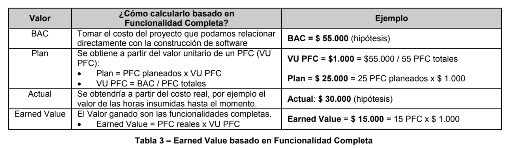

# Indicadores Objetivos para Control de Proyectos de Desarrollo de Software

https://drive.google.com/file/d/1EA0O6lYQ5kNCXTCVbfy44I2O3TKEPefE/view

# Problemas clásicos
Uno de los problemas típicos es el síndrome del 90% (figura 1), síndrome por el cual el proyecto avanza sin
problemas hasta que llega al 90% y se estanca.

Normalmente esto sucede porque utilizamos información subjetiva para registrar avance y cuando nos enfrentamos a la realidad, nos enteramos que el avance no era real.

## El Indicador de Funcionalidad Completa

El indicador de Funcionalidad Completa mide avance cuando una funcionalidad está completa, pero...

* No hay avance si la funcionalidad no está completa
* No está completa la funcionalidad si no está desarrollada, probada y estabilizada.

Paso 1 - Determinar las Funcionalidades

Paso 2 - Asignar un Peso a cada funcionalidad

Paso 3 - Estimar la fecha en que la  funcionalidad estará completa

Paso 4 - A medida que avanza el proyecto registrar las fechas reales de funcionalidad completa

* Puntos de funcionalidad completa (PFC)

### Consideraciones sobre este indicador

* Validez: este indicador sólo es valido en etapa de construcción. No se utiliza en el período final de estabilización ya que durante ese período la funcionalidad real es similar a la planificada.
* Proceso: este indicador no generará avance si el equipo no se focaliza en cerrar temas. El indicador es binario, la funcionalidad está completa o no está.
* Síndrome del 0%: si se considera completa a una funcionalidad cuándo no tiene ningún defecto, evitaremos el síndrome del 90%, pero caeremos en el síndrome del 0%, es decir, no registraremos avance porque siempre habrá algún defecto pendiente. Es por eso que una funcionalidad está completa cuando no posee defectos críticos, pero sí tiene defectos pendientes.

## El Indicador de Nivel de Calidad

Como vimos hasta ahora, el indicador de funcionalidad completa divide al producto en dos estados: funcionalidad completa o no completa. Algunas veces necesitamos utilizar estados intermedios. Estos estados muestran el ciclo de vida por el que va pasando el producto desde el punto de vista de la calidad (figura 4) y permiten tener un indicador más detallado que denominamos Nivel de Calidad (tabla 2, figura 5).

## Indicador de Evolución de prueba 

El indicador de Evolución de la Prueba se basa en una idea simple: **medir los defectos, cuántos aparecen y cuántos se cierran por día.**

1. Registrar los defectos nuevos a medida que aparecen
2. Registrar los cambios de estado de los mismos hasta que se cierran definitivamente

Analizando el comportamiento de los defectos a lo largo del proyecto este indicador nos permite obtener estadísticas que determinan la velocidad de corrección y por lo tanto el tiempo estimado para estabilizar el producto. Podemos saber cuántos defectos se encuentran y cuántos se cierran en un  determinado período de tiempo.

### Consideraciones sobre el indicador 

1. Validez: este indicador es válido durante todo el proyecto cuando hay prueba en paralelo al desarrollo. Si sólo hay prueba al final, el indicador es muy útil durante la etapa de prueba final y estabilización.
2. Proceso: el indicador es muy útil para detectar el síndrome del 90 %, por ejemplo cuando avanza el código completo, pero la funcionalidad posee gran cantidad de defectos pendientes.

## Indicador de cobertura de prueba 

La Cobertura de la Prueba muestra **cuánto habría que probar, cuánto se pudo probar y cuánto funciona bien** 

* Planificados: cantidad de casos a ejecutar.
* Disponibles: lo que realmente puedo ejecutar teniendo en cuenta lo que el equipo de desarrollo entregó al equipo de prueba.
* Ejecutados: lo que el equipo de prueba pudo ejecutar.
* Ejecutados OK: casos ejecutados sin errores. Es otra forma de ver avance del proyecto.

## El Indicador de Earned Value

Ya conocemos el grado de avance y tenemos menos incertidumbre sobre la fecha de fin, pero... ¿Cuánto costará realmente? Consideramos útil para responder esta pregunta utilizar el indicador de Earned Value.

Consideraciones sobre este indicador
* Alcance: es necesario separar los costos que no están asociados directamente a la construcción de software.
Por ejemplo, la adquisición de un equipo, la planificación inicial, el despliegue, etc. Otros costos, como la administración del proyecto, podrían distribuirse dentro de los PFC.
* Validez: al igual que el indicador de Funcionalidad Completa, sólo aplica a la construcción, no a la estabilización.
* Margen de error: existe cierto margen de error aceptable con el objetivo de no aumentar la carga administrativa debido a:
- Los pesos generan información inexacta
- El Actual está insumido en funcionalidades que aún no están completas
- Los costos indirectos que se distribuyen en los PFC pueden generar margen de error.