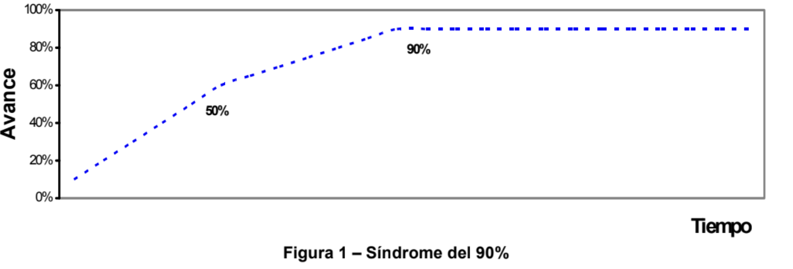

# Estimadores e indicadores

Necesitamos estimar para poder administrar el tiempo, el alcance y los costos de un proyecto, y los indicadores nos ayudan a medir el progreso y la calidad del mismo.

* Estimaciones: Para planificar.
* Indicadores: Para medir y controlar

## Estimaciones

Sirve para entablar un diálogo entre el cliente y el equipo de desarrollo. Se trata de una conversación en la que se busca entender las necesidades del cliente y cómo se pueden satisfacer. La estimación es una herramienta para facilitar esta conversación.

## Estimación vs Objetivos vs Comperomisos

* Estimacíon: Predicción(algo que esta en el futuro) acerca de la duración o costo de una actividad o proyecto.

* Objetivo: Enunciación de un logro deseable del negocio. 
    * Tener un sistema listo para el 31 de enero. 
    * **Un objetivo no siempre se puede lograr.** 
    * La existancia del objetivo no cambia la estimación. Puede pasar la situación en la que un objetivo sea inalcanzable, pero la estimación no cambia. 

Se necesita una conversación entre el cliente y el equipo de desarrollo para llegar a un acuerdo sobre los objetivos y las estimaciones.

* Compromiso: Promesa para entregar una funcionalidad definida con una calidad determinada en una fecha dada. La estimación + el objetivos me tendrían que llevar a asumir un compromiso(se busca modificar algunas condiciones para poder lograr un acuerdo).

Las estimaciones son valores estadisticos, es un:

* Rango de valores, no un valor único.
* Una afirmación probabilística.

### Hay un tiempo y costo minimo

* Fecha minima: la primer fecha con una probabilidad no nula de entregar 
* Antes de la fecha minima no hay probabilidad de entregar.
* Fecha de inicio < Tiempo minimo < Compromiso 

El compromiso que asumimos depende de la probabilidad que queramos asumir, el riesgo que queramos asumir.

## Todo proyecto siempre implica incertidumbre

* Hay riesgo 
* Hay desconocimiento
* Hay deslizamiento de alcance(al cliente se le ocurre agregar algo nuevo, el alcance se va modificando)

Es importante comunicar la incertidumbre al cliente. Hya que expresar rangos y probabilidades. Y hay que convencer al cliente de la naturaleza probabilística de los proyectos.

## Precisión

La presisicón depende de: 

* Experiencia del estimador
* Nivel de refinamiento de la estimación
    * Alto: Variabilidad baja 
    * Bajo: Variabilidad alta 

Disminuye muy rapido la presición en las primeras etapas del proyecto.

No depende del tiempo que se de para estimar.

## Estimación = f(t)
La estiamción no se hace una unica vez, puede haber cambios en el proyecto, y la estimación se tiene que ir actualizando. Siempre hay que comunicar al cliente que la estimación es una predicción y que puede cambia, y como va cambiando con el tiempo.

* A medida que el proyecto avanza, podemos ir midiendo. 
* El cliente conoce mejor lo que necesita y lo que se puede lograr, me puede dar un feedback que puede ayudar a mejorar la estimación.
* La estimación se va refinando a medida que se avanza en el proyecto.

## Utilidad del cono de incertidumbre

El cono de incertidumbre es una representación gráfica que muestra cómo la incertidumbre disminuye a medida que se avanza en el proyecto. Al principio, la incertidumbre es alta y la estimación tiene un rango amplio. A medida que se avanza, la incertidumbre disminuye y la estimación se vuelve más precisa.

Para poder estimar a lo largo del proyecto lo que hay que hace es: 

* Medir -- mejorar la estimación